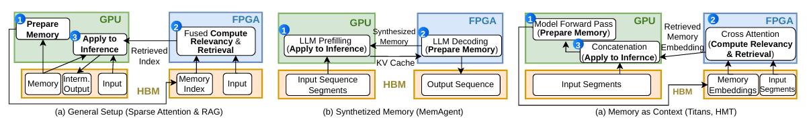

# FPGA在LLM领域的应用调研

## 1. 单 FPGA 实现 LLM 推理

### 1.1 总体判断

这类论文反复强调 FPGA 在 decode 阶段 GEMV 计算上的优势，但这一优势并不普适，原因如下：

1. Decode 阶段通常是 memory-bound 的，GEMV 性能主要受有效内存带宽制约。以 H100 为例，其 HBM 带宽可达 3.35 TB/s，而常见 FPGA 板卡的 HBM/DDR 带宽通常低得多。相较于 prefill，GPU 与 FPGA 在 decode 阶段的差距可能缩小，但这不等于 FPGA 领先。
2. 类似GQA、MLA的算法中，一个KV head可以对应多个qurey head，那么在一次decode前向中，就可以把一个token的一个KV head对应的多个query head的计算放在一起，形成一个小规模的GEMM，从而提高算术强度，增加权重复用。

这类论文中往往以之前的FPGA加速器作为主要比较对象，而与GPU的比较很少，甚至没有，与GPU的比较结果往往是decode远低于GPU的性能。

### 1.2 DFX

1. 多块FPGA，成本高
2. 架构复杂，需要实现微指令控制器和跨FPGA通信机制

### 1.3 Understanding the Potential of FPGA-Based Spatial Acceleration for Large Language Model Inference

该论文提出了空间架构，在FPGA上实现了不同计算单元，分别处理不同的计算任务，比如计算attention和计算FFN的计算单元是不同的，可以在不同计算单元计算不同的token来形成流水线。然而，这种架构与decode天然存在矛盾，decode阶段只有一个token向量，根本无法充分利用不同计算单元的并行性，并且，像layernorm这种计算需要在attention和FFN之间进行，而Layernorm这种计算需要整个token向量，导致attention和FFN之间存在流水屏障，进一步限制了并行流水的效果。这种空间架构降低了FPGA的利用率，增加了FPGA的面积和功耗。
1. LLM中的一些运算需要用到整个上一阶段计算完成的token向量，天然不适合进行跨阶段流水线设计，流水线只存在于单个算子内部，比如attention和FFN内部的流水线。
2. FPGA上应该去设计更加通用的计算单元，比如一个矩阵乘法计算单元，可以计算attention中的QK和PV以及FFN的矩阵乘法，而不是为每个算子设计不同的计算单元。
### 1.4 Hummingbird & Hummingbird+

Hummingbird中提出根据带宽设计FPGA的计算单元，由于带宽有限，即使设计再大的计算单元，由于带宽无法提供更多参数权重，也无法提高计算单元的利用率。Hummingbird中的带宽为19.2 GB/s，带宽很小，所以需要的FPGA资源也很小，比较容易复现。
其中主要设计了一个矩阵乘法单元，该单元在性能上可能与传统的二维脉动阵列和树形阵列相比并没有优势，但减少了FPGA资源（DSP和FF）的使用，具体架构如图：

这仍然是一个树结构，其中包含 MAC DSP chain 和 add DSP chain。
MAC DSP chain 如下图所示，它充分使用了一个 DSP 单元中的乘法器和加法器，chain 中每个 DSP 每周期执行一次 MAC 运算，并且支持两种模式，可以避免计算 $PV$ 时对 $V$ 进行转置。

Add DSP chain 如下图所示，通过 3 个 DSP 级联实现 6 输入、1 输出的加法器。

传统树结构需要 128 个 DSP 作为乘法器，$64+32+16+8+4+2+1=127$ 个 DSP 作为加法器，一共需要 255 个 DSP；Hummingbird 只需要 $128+15+1+3=147$ 个 DSP，节省 108 个 DSP，即约 42% 的 DSP 资源。
Hummingbird+进一步去优化了Hummingbird中的计算单元设计和流水线设计，实现了混合精度设计。Hummingbird+中提到的`MOE重新给了低端FPGA机会`，其实就是说MOE让一次decode需要的参数量减少了，使得在FPGA上生成token的速度：

$$
\text{生成速度}\approx
\frac{\text{有效内存带宽}}
{\text{每个 token 需要读取的有效参数字节数}}
$$

达到了可用的程度。

## 2. FPGA–GPU 混合架构实现 LLM 推理

### 2.1 任务划分原则

将 GPU 不擅长的工作交给 FPGA，由两者协作完成 LLM 推理。适合交给 FPGA 的工作至少应满足以下三点：

1. 是当前GPU不擅长的工作，不规则或数据依赖的随机访存，高稀疏，非标准压缩格式或者混合精度
2. 交给FPGA的工作需要有明确的边界，最好不需要与GPU进行频繁的大量数据交互，减少数据传输的开销。比如如果把MOE的router、token聚合和cold experts的计算交给FPGA，那么LLM每层的MOE计算都需要在GPU和FPGA之间传输数据，通信非常频繁，这不是说这样划分任务一定不会取得好的效果，而是想要将这种频繁的通信的开销通过调度和流水线设计来掩盖掉是非常困难的。
3. 最好部分状态可以常驻在FPGA上。

FPGA+GPU混合架构的实验验证往往需要和GPU单机进行对比，验证混合架构的性能提升是否值得增加FPGA的成本和复杂度，而不像单FPGA实现LLM推理那样，往往只和之前的FPGA加速器进行对比。

### 2.2 协作粒度

这种混合架构还可以分为两种：
1. 算子级的协作，比如把sparse attention的选取top-k和计算score交给FPGA，GPU只做attention的计算。这种协作一般有两个特点：
   1. FPGA和GPU之间的通信频率较高，GPU每次计算都需要把数据传给FPGA，FPGA计算完再返回给GPU。
   2. FPGA和GPU之间的计算可能存在依赖，难以设计流水线调度。
    
    所以说，这种协作必须有明确的边界，通信数据量不能太大，因为难以流水线调度掩盖通信开销，所以需要加速节省的时间必须大于通信开销，否则就没有意义。但这种协作中，GPU往往只需要设计部分算法的FPGA加速器，而不是整个算法的FPGA加速器，设计难度相对较低。
2. 阶段级的协作，比如把LLM推理的decode阶段交给FPGA，GPU只做prefill阶段。这种协作一般有两个特点：
   1. FPGA和GPU之间的通信频率较低，GPU每次计算完一个阶段才需要把数据传给FPGA，FPGA计算完再返回给GPU。
   2. FPGA和GPU之间的计算可能不存在依赖，可以设计流水线调度。
   
   所以说，这种协作可以设计流水线调度掩盖通信开销，但这种协作中，往往需要设计整个算法的FPGA加速器，而不是部分算法的FPGA加速器，设计难度相对较高。
### 2.3 Understand and Accelerate Memory Processing Pipeline for Large Language Model Inference

这篇论文将LLM系统中的memory process的相关操作整理成4个阶段，并尝试将其中的部分memory bound阶段交给FPGA处理，我认为非常具有参考价值。

#### 2.3.1 四段 memory processing pipeline

通过 arithmetic intensity 分析不同阶段的计算密集度；arithmetic intensity 较低的阶段可以认为是 memory-bound，可以尝试放到 FPGA 上处理。

$$
\text{Arithmetic Intensity}=\frac{\text{FLOPs}}{\text{Bytes transferred}}
$$

#### 2.3.2 GPU–FPGA 系统的三种部署方式

##### 1. General Setup：Sparse Attention 和 RAG

这是论文最主要的架构。

GPU 执行

* Prepare Memory；
* Apply to Inference；
* 保存完整 KV cache、文档和 LLM 权重；
* 根据 FPGA 返回的索引提取真正的 KV 或文档。

FPGA 执行

* Compute Relevancy；
* Retrieval；
* 将两步融合为单个流式 kernel；
* 保存压缩后的 memory index。

数据流如下：

$$
\text{GPU生成索引}
\rightarrow
\text{FPGA保存索引}
$$

每次 query：

$$
\text{GPU发送query}
\rightarrow
\text{FPGA计算score和top-k}
\rightarrow
\text{GPU接收indices}
\rightarrow
\text{GPU提取KV并执行attention}
$$

**为什么不把 KV cache extraction 也放到 FPGA**

从计算性质看，KV extraction 也是不规则、memory-bound 的，似乎也适合 FPGA。

但如果 FPGA 提取 KV，就必须把选中的完整 KV 通过 PCIe 传回 GPU。其传输量远大于 top-k indices。

因此作者只返回索引：

$$
\text{FPGA}\rightarrow\text{GPU}:
\quad
{i_1,i_2,\ldots,i_k}
$$

而不是：

$$
\text{FPGA}\rightarrow\text{GPU}:
\quad
{K_{i_j},V_{i_j}}_{j=1}^{k}
$$

GPU 已经保存完整 KV，所以只需根据索引执行 gather。

这是论文最关键的系统设计决策之一：FPGA 保存小型索引副本，GPU 保存原始数据。

**具体kernel架构**

可以看到，这种kernel设计的复杂度明显低于前面将所有LLM推理阶段都放到FPGA的设计。

**batch 越大，FPGA 相对优势越大**

原因是：

* 不同样本的 KV index、BM25 query 和 top-k 结果无法共享；
* batch 增大主要改善 GPU 上 dense GEMM 的效率；
* 检索部分仍然无法获得同等的 batch reuse；
* 于是检索占端到端延迟的比例越来越高；
* FPGA 加速该部分带来的端到端收益反而更明显。
##### 2. Synthesized Memory：MemAgent

MemAgent 的 memory generation 是 LLM decode，memory application 是 LLM prefill。

作者采用 prefill–decode disaggregation：

* GPU：执行 prefill；
* FPGA：执行 decode，生成文本 memory。

每个 segment 的过程是：

1. GPU 对 segment 做 prefill；
2. GPU 将 KV cache 发送给 FPGA；
3. FPGA 根据 KV cache 自回归生成 memory token；
4. FPGA 将 token ID 返回 GPU；
5. GPU 把生成的 memory 和下一个 segment 拼接并继续 prefill。

论文实验说明，这种划分只适合小 batch：

| Batch size | MemAgent GPU–FPGA 相对 GPU 的速度 |
| ---------: | ---------------------------: |
|          1 |                 $1.85\times$ |
|          2 |                 $1.65\times$ |
|          4 |                 $0.93\times$ |
|          8 |                 $0.49\times$ |
|         32 |                 $0.13\times$ |

原因是 batch 增大后，GPU decode 可以跨样本复用权重并提高 HBM/Tensor Core 利用率，而 FPGA 的 dense compute 吞吐不足。

因此作者提出 batch 大于 2 时动态回退到 GPU-only。

这说明“GPU prefill + FPGA decode”不是普遍最优，只在低 batch、低延迟场景更有价值。

**batch 越大，FPGA 严重落后**

因为这里 FPGA 执行的是整个 dense LLM decode，batch越大，GPU上的权重复用率越高。
##### 3. Memory as Context：Titans/HMT

该方法不断从 input segment 生成 memory embedding（摘要），再从历史 memory 中检索相关内容。

论文采用：

* GPU：模型 forward，生成新 memory embedding（摘要）；将检索结果拼接到当前 segment；
* FPGA：query projection、cross attention、relevancy 和 retrieval；
* 历史 memory embedding 只保存在 FPGA HBM 中。

循环过程为：

1. GPU 根据当前 segment 产生摘要；
2. 摘要流入 FPGA；
3. FPGA 将摘要投影为 query；
4. FPGA 从历史 memory 中检索相关 embedding；
5. 检索到的少量 embedding 返回 GPU；
6. GPU 将其加入下一轮模型输入。

这种映射避免了 GPU 和 FPGA 各自保存一份完整 memory embedding，具有更好的数据局部性。

**batch 越大，优势逐渐减小**

FPGA 上的 cross attention 包含部分线性投影。随着 batch 增大，GPU 可以更好地复用线性层权重，因此 FPGA 的相对优势下降

### 2.4 DFVG

这篇论文中将drafter部署在FPGA上，将target部署在GPU上。为了提高drafter的吞吐量，drafter使用了tree-based speculative decoding算法，drafter的输出是一个树结构，target从树结构中选择最优的token链作为最终输出。
在GPU上的target进行验证的同时，drafter会持续构建树结构，在target验证完成后，drafter会进行剪枝和回退，再继续构建树结构。这将drafter和target的工作进行了流水线化，减少了等待时间，提高了系统的吞吐量。
有关算法相关细节可见[树状结构的speculative decoding算法](./tree_based_speculative_decoding_workflow.md)。

#### TreeSort-Verify：GPU 如何验证一棵树

DFVG 通过 path packing 对节点重新排序，使同一路径或具有较多共享祖先的 token 尽可能相邻。例如可以重排为：

$$
R,\ A,E,H,D,\ B,F,\ C,G,I,J
$$

之后再根据 sibling 和 path 关系将节点划分为若干 block。每个 block：

- 查询自身路径对应的局部 KV；
- 读取公共 prefix KV；
- 可以在不同 GPU SM 上独立执行；
- 完成计算后，再按照原始 token tree 的索引恢复输出顺序。

论文将其写为：

$$
\mathrm{Att}_{\mathrm{tree}}=
\bigoplus_{k=1}^{K}
\mathrm{Att}_{\mathrm{block}}
(Q_{B_k},K_{B_k},V_{B_k},M_{B_k})
$$

其中，$\bigoplus$ 表示将各 block 的输出恢复到原始 token tree 顺序。
#### FPGA 上的 Multi Compute Core Overlay

##### PE 数据流

多个计算核分别计算输出向量的一部分：

$$
y=\sum_c W_cx
$$

各计算核产生 partial sum，最后通过并行加法树合并。

这里的PE的架构是二维脉动阵列，其中模型权重保存在每个micro PE上，流动的是activation和partial sum，这与把partial sum保存在每个micro PE上，流动的是activation和模型权重的脉动阵列不同。两者的区别可以查看[脉动阵列的两种数据流](./二维脉动阵列_Output-Stationary与DFVG数据流对比.md)。

硬件调度被拆分为：

- LD：加载权重和输入；
- PE：执行矩阵计算；
- SF：执行非线性算子；
- ST：写回结果。

论文通过 ping-pong buffer 让数据加载与计算相互重叠，从而尽量隐藏 HBM 访问时间。

##### 多分支权重复用

对于普通单路径 draft decode，每生成一个 token 都需要重新读取大部分模型权重，权重复用很低。DFVG 同时处理多个 speculative branch，使一个权重 tile 可以被多个 branch activation 复用：

$$
W[X_1,X_2,\ldots,X_B]
$$

这相当于把原来的 GEMV 转化成小规模 GEMM。PE 在处理当前权重 tile 的多个分支时，存储系统可以预取下一块权重，从而提高有效带宽利用率。

论文给出的调度关系为：

$$
KER_{\mathrm{load}} =
\frac{
PE_{\mathrm{num}}\times Data_{\mathrm{width}}
}{
Bandwidth
}
$$

$$
IFM_{\mathrm{load}} =
KER_{\mathrm{load}}+CAS_{\mathrm{latency}}
$$

相关缩写的含义如下：

| 缩写 | 全称 | 在 DFVG 中的含义 |
|---|---|---|
| KER | Kernel | Transformer 的权重矩阵或当前加载的权重 tile，不是 CUDA/FPGA 程序 kernel |
| IFM | Input Feature Map | 当前算子的输入 |
| CAS | Column Address Strobe | DRAM/HBM 的列访问机制；CAS latency 表示发出读取命令到第一批有效数据返回之间的启动延迟 |

上述公式表示算子输入一次加载的时间等于权重加载时间+DRAM/HBM 的启动延迟。算子当前计算的时长应该大于等于下一次算子输入加载的时长，否则算子计算完成后就需要等待下一次算子输入加载完成，导致算子计算单元空闲。

##### 一个 DSP 同时执行两个 BF16 乘法

论文利用了多分支计算中的一个特殊条件：同一个权重 $B$ 会同时乘以两个不同 branch 的 activation $A_1,A_2$。

将两个 BF16 尾数打包到 DSP58 的宽输入端：

$$
A_{\mathrm{packed}} =
(A_2\ll s)+A_1
$$

再与共享权重 $B$ 相乘：

$$
A_{\mathrm{packed}}B =
(A_2B\ll s)+A_1B
$$

只要在两个结果之间预留足够的 guard bits，就能从 DSP 输出中分别提取：

$$
P_1=A_1B,\qquad P_2=A_2B
$$

指数部分则在 DSP 外部单独计算：

$$
e_{P_1}=e_{A_1}+e_B,\qquad
e_{P_2}=e_{A_2}+e_B
$$

这并不意味着一个 DSP 可以无条件执行任意两个 BF16 乘法。该打包方法要求两个乘法共享同一个乘数，而 DFVG 的多 branch 计算恰好提供了“同一权重乘多个 activation”的结构。

这是 DFVG 中比较具有 FPGA 特征的优化：算法层面的多分支不仅提高了权重复用率，也创造了可以利用 DSP 位宽进行乘法打包的硬件条件。

具体过程可查看[DFVG中一个DSP同时执行两个BF16乘法的原理](./DSP58_单DSP双BF16乘法原理.md)。

#### Draft KV cache 如何处理 branch 和 rollback

每条 speculative branch 都会产生自己的 K/V。如果把所有候选 KV 直接写入正式 cache，那么分支被拒绝时就需要进行大量不规则删除或搬移。

DFVG 使用两级管理方式。

- 临时 branch buffer

  - 保存尚未被 target model 验证的 candidate KV；
  - 不同 branch 使用独立或可区分的临时区域；
  - verification 返回后，被拒绝的整条分支可以直接释放。

- Accepted/prune buffer

  - 将已接受路径的 KV 搬入逻辑连续区域；
  - 保持正式序列的 KV 索引连续；
  - 累积到一定规模后再批量写回外存；
  - 避免频繁、细粒度的 HBM 写操作。

假设 FPGA 已沿某个分支生成到 token 10，但 GPU 最终只确认到 token 6：

1. token 7–10 对应的 branch KV 全部失效；
2. FPGA 将本地 sequence index 回退到 token 6；
3. 保留 token 1–6 的 KV；
4. 从 GPU 确认的 prefix 重新开始 drafting。

GPU 侧的 target KV cache 同样只提交最终被接受路径上的 KV，其余 candidate KV 被丢弃。

#### FPGA-GPU 流水线如何运行

完整时间线可以理解为：

1. FPGA 生成第一棵动态 token tree。
2. 当树深达到 $D_{\min}$ 后，将 token tree 送入待验证队列。
3. CPU 通知 GPU，GPU 开始执行 TreeSort-Verify。
4. GPU 验证上一棵树时，FPGA 继续沿尚未确认的路径向前生成。
5. GPU 返回接受的前缀长度和已确认 token。
6. 如果 FPGA 预测正确，则提交相应的 draft KV。
7. 如果 FPGA 预测错误，则回滚并清除无效 branch KV。
8. 如果 FPGA 太慢，GPU 不必永久等待，可以由 target model 自己继续生成正确 token。
9. 如果 GPU 太慢，FPGA 可以继续 speculative ahead，但超前产生的结果之后可能被保留，也可能因回滚而丢弃。

因此，GPU 始终处于以下两种状态之一：

- 验证 FPGA 产生的 token tree；
- 自己执行 target autoregressive generation。

FPGA 则尽量持续产生候选。

### 2.5 GLITCHES

GLITCHES是一种阶段级 GPU–FPGA 异构推理系统：GPU 执行计算密集的 prefill，FPGA 执行小 batch 下带宽受限的 decode。它没有把单个 Transformer 层拆到两种设备上，而是在 prefill/decode 边界一次性迁移 KV cache，因此任务边界比算子级协作更清晰。

#### 2.5.1 系统架构与数据流

系统由 Host CPU、一个或多个 GPU 以及多个 HBM FPGA 组成。每张 GPU 和 FPGA 都保存完整模型权重，CPU 负责请求调度、采样和设备间的数据转发。

一次请求的执行流程如下：

1. CPU 将 prefill 请求分配给 GPU，GPU 使用 FP16 完成 prefill，并逐层生成 KV cache。
2. GPU 将 FP16 KV cache 量化后，经 PCIe 传到 Host 内存，再由 Host 转发到指定 FPGA 的预留 HBM 地址。
3. KV 传输与 GPU 上不同 Transformer block 的 prefill 形成流水，尽量隐藏迁移开销。
4. GPU 将首 token logits 返回 CPU，CPU 完成采样并把 token ID 发送给持有该请求 KV cache 的 FPGA。
5. FPGA 基于已迁移的 KV cache 执行后续 decode；每轮 logits 返回 CPU，CPU 采样后再把下一个 token ID 发回 FPGA。
6. 请求结束后释放对应状态。FPGA 接管 decode 后，GPU 不再保留该请求的 KV cache，可继续处理新的 prefill。

系统的数据路径可以概括为：

$$
\text{GPU prefill}
\rightarrow
\text{KV 量化与逐层迁移}
\rightarrow
\text{FPGA decode}
$$

#### 2.5.2 调度与扩展

由于 decode 通常占据更长的服务时间，GLITCHES 使用“一张 GPU 对多张 FPGA”的非对称配置。Host 调度器按照先到先服务策略把 decode 请求分配给空闲 FPGA；如果所有 FPGA 都忙，GPU 可以保留 KV cache 并直接执行 decode，避免请求长期排队。

这种设计的优点是 prefill 和 decode 设备可以独立扩容；代价是每张设备都要保存完整模型权重，并且系统需要维护请求、KV 地址和设备状态之间的映射。

#### 2.5.3 HBM 数据预取

GLITCHES 的 FPGA decode 基于 FlightLLM。FlightLLM 的分组混合精度量化会产生 scale、zero point 等元数据，约占权重体积的 4%–6%。权重与元数据位于不同片上缓冲区，原始调度会发出大量细粒度 LD 指令；指令译码与发射开销使 U280 的 HBM 带宽利用率只有约 40%。

GLITCHES 将后续多个矩阵–向量计算需要的权重和量化元数据提前读取，把多个小请求合并为较粗粒度的访问。预取不会减少总字节数，但会减少 LD 指令数量并增大单次访问尺寸。论文通过误差小于 5% 的性能模拟器为每层选择预取比例；在实验中，预取比例 $M=4$ 最优，例如 q_proj 的单次权重访问从 8 KB 增至 32 KB，元数据访问从 256 B 增至 1 KB。

预取过小不足以摊薄指令开销，过大则会增加片上缓冲压力，并使访存与计算更难形成流水。因此，预取粒度是带宽利用率、缓冲容量和流水覆盖之间的折中。

#### 2.5.4 实验结果

论文使用 LLaMA2-7B：GPU 端为 FP16，FPGA 端为近似 W4A8 的量化实现；GPU 平台为 A100/V100S，FPGA 平台为 U280。数据预取使序列长度为 128 和 1024 时的端到端 decode 性能分别提升 $1.20\times$ 和 $1.16\times$。

| 8 卡系统配置 | 对比基线 | 吞吐提升 | 成本效率提升 |
|---|---|---:|---:|
| 1×A100 + 7×U280 | 8×A100 | $1.28\times$ | $2.38\times$ |
| 1×A100 + 7×U280 | 8×U280 | $1.23\times$ | $1.08\times$ |
| 1×V100S + 7×U280 | 8×V100S | $1.34\times$ | $1.90\times$ |
| 1×V100S + 7×U280 | 8×U280 | $1.21\times$ | $1.14\times$ |

| 指标                 |      A100 FP16 |     V100S FP16 |      U280 W4A8 |
| ------------------ | -------------: | -------------: | -------------: |
| 峰值带宽               |      1935 GB/s |      1134 GB/s |       460 GB/s |
| Prefill 1536 延迟    |      175.85 ms |      398.80 ms |     5001.20 ms |
| Decode 平均延迟        | 24.26 ms/token | 29.52 ms/token | 21.50 ms/token |
| Decode 每 token 访存量 |       14.08 GB |       14.08 GB |        3.96 GB |
| Decode 带宽利用率       |         29.99% |         42.06% |         40.08% |
| Decode 功耗          |        167.3 W |        222.5 W |         46.0 W |

这篇论文中FPGA使用的参数是W4A8，而GPU使用的参数是FP16，所以说这里Decode 平均延迟指标的FPGA之所以能比 A100 的 24.26 ms 略快，不是因为它具有更高带宽，而是因为FPGA使用了更低bit的参数，减少了每个token需要读取的有效参数字节数，从而提高了生成速度。

### 2.6 A Persistent-State Dataflow Accelerator for Memory-Bound Linear Attention Decode on FPGA
这篇论文将GDN部署在FPGA上，论文声称的最佳结果是单个 GDN layer、batch=1、FP32 decode 延迟为 $63.2\ \mu s$，相对 H100 PyTorch reference 加速 $4.5\times$。但该结果只来自 HLS 综合周期估计；真正完成布局布线的 $H_{\text{iter}}=2$ 配置在 263 MHz 下为 $161.7\ \mu s$，相对 H100 的严格可实现加速约为 $1.76\times$。
#### 2.6.1 Persistent-State GDN
GDN中的线性注意力大小不会随着序列长度的增加而增加，所需要的状态量固定，非常适合常驻在FPGA当中，省去反复加加载的开销。

论文针对 Qwen3-Next 风格的单个 GDN layer：

| 参数 | 数值 |
|---|---:|
| query heads $h_q$ | 16 |
| key heads $h_k$ | 16 |
| value heads $h_v$ | 32 |
| head dimension $d$ | 128 |
| 数据类型 | FP32 |
| batch size | 1 |
| 每个 value head 的状态 | $128\times128$ FP32 |

总状态容量为：

\[
h_vd^2\times4
=32\times128\times128\times4
=2{,}097{,}152\ \text{bytes}
=2\ \text{MiB}.
\]

GPU 每个 token 至少需要读取和写回一次状态，因此状态流量为：

\[
2\ \text{MiB read}+2\ \text{MiB write}
=4\ \text{MiB/token/layer}.
\]

除此之外，整次 recurrence 只有约 $4.2$ MFLOPs。按是否计入 token 输入等细节，其算术强度约为 $0.87\sim1.0$ FLOP/B，远低于 H100 FP32 roofline 的 ridge point，因此结构上属于 memory-bound workload。

状态既可以常驻在FPGA，并且本身计算强度低，非常适合 FPGA 处理。

#### 2.6.2 计算优化
论文对状态更新和输出计算进行了优化，将状态访问次数从3次降到2次。

将状态更新代入输出：

\[
\begin{aligned}
S_t^{\mathsf T}q_t
&=\left(g_tS_{t-1}+k_t\Delta v_t^{\mathsf T}\right)^{\mathsf T}q_t\\
&=g_tS_{t-1}^{\mathsf T}q_t
+\Delta v_t(k_t^{\mathsf T}q_t).
\end{aligned}
\]

等价地写成：

\[
S_t^{\mathsf T}q_t
=g_tS_{t-1}^{\mathsf T}q_t
+(q_t^{\mathsf T}k_t)\Delta v_t.
\]

于是第一次读取旧状态时，可以同时计算：

\[
r_t=S_{t-1}^{\mathsf T}k_t.
\]

和：

\[
\hat o_t=g_tS_{t-1}^{\mathsf T}q_t.
\]

之后用一个向量修正项得到输出：

\[
\Delta v_t=\beta_t(v_t-r_t).
\]

\[
o_t=\frac1{\sqrt d}{(\hat o_t+(q_t^{\mathsf T}k_t)\Delta v_t)}.
\]

因此无需为了输出再次读取更新后的 $S_t$。状态访问变为：

1. 一次 read pass：同时计算 $S_{t-1}^{\mathsf T}k_t$ 和 $S_{t-1}^{\mathsf T}q_t$；
2. 一次 read-modify-write pass：计算并写回 $S_t$。

理论状态遍历成本从 $3072$ cycles 降为约 $2048$ cycles；计入短向量运算和流水启动，论文 HLS 报告中的实际 iteration interval 约为 $2106$ cycles，约带来 $1.46\times$ 改善。

#### 2.6.3 dataflow architcecture

论文使用hls设计IP核，实现了5阶段流水线，分别是：
- Phase 1：query-key 点积

\[
a_t=q_t^{\mathsf T}k_t.
\]

这里用 $a_t$ 表示临时点积，避免与门控输入 $\alpha_t$ 混淆。

- Phase 2：一次状态读取完成两组矩阵向量乘

在同一次 BRAM read pass 中，对旧状态同时累加：

\[
r_t=S_{t-1}^{\mathsf T}k_t,
\]

\[
\hat o_t=g_tS_{t-1}^{\mathsf T}q_t.
\]

同一个状态元素被同时用于与 $k_t$ 和 $q_t$ 相乘，从而共享状态读取。

- Phase 3：Delta correction

\[
\Delta v_t=\beta_t(v_t-r_t).
\]

- Phase 4：输出修正

\[
o_t=\frac1{\sqrt d}(\hat o_t+a_t\Delta v_t).
\]

- Phase 5：状态更新

\[
S_t=g_tS_{t-1}+k_t\Delta v_t^{\mathsf T}.
\]

并设计了Prepare–Compute–Store 三层 dataflow

每个 head group 的处理分成三个大阶段：

1. **Prepare**：从输入 buffer 取对应的 $q,k,v$，计算 $g_t,\beta_t$；
2. **Compute**：执行五阶段 fused GDN datapath；
3. **Store**：把该组输出经 AXI 写回外部存储。

HLS dataflow 允许不同 head groups 重叠：

- group $n-1$：Store；
- group $n$：Compute；
- group $n+1$：Prepare。

稳态 interval 由最慢的 Compute 阶段决定，约为：

\[
II_{\text{group}}\approx2106\ \text{cycles}.
\]

需要特别强调：这种重叠发生在**同一个 token 的不同 head group 之间**，不是相邻生成 token 之间的流水。自回归依赖仍要求下一个 token 等待当前 token 以及模型剩余算子完成。

#### 2.6.4 实验结果
| 配置 | 周期数 | 延迟 | 相对 H100 | 证据级别 |
|---|---:|---:|---:|---|
| H100 PCIe | — | $285\ \mu s$ | $1\times$ | GPU 实测 |
| $H_{\text{iter}}=2$，300 MHz | 42,538 | $141.7\ \mu s$ | $2.0\times$ | HLS 综合周期估计 |
| $H_{\text{iter}}=2$，263 MHz | 42,538 | $161.7\ \mu s$ | 约 $1.76\times$ | 完成布局布线 |
| $H_{\text{iter}}=4$，300 MHz | 26,252 | $87.4\ \mu s$ | $3.3\times$ | 综合；布局布线失败 |
| $H_{\text{iter}}=8$，300 MHz | 18,978 | $63.2\ \mu s$ | $4.5\times$ | 仅综合估计 |
| $H_{\text{iter}}=16$，300 MHz | 23,206 | $77.4\ \mu s$ | $3.7\times$ | 仅综合估计 |

该论文比较的仅为单个 GDN layer 的 decode 延迟，而不是整个 LLM decode 延迟。由于 GDN layer 只占 LLM decode 的一部分，论文声称的 $4.5\times$ 加速并不代表整个 LLM decode 的加速。
## 3. 专题文档索引

- [Tree-based Speculative Decoding：Draft 构树与 Target 验证计算流程](./tree_based_speculative_decoding_workflow.md)
- [二维脉动阵列：Output-Stationary 与 DFVG 数据流对比](./二维脉动阵列_Output-Stationary与DFVG数据流对比.md)
- [一个 DSP 同时计算两个 BF16 乘法的原理](./DSP58_单DSP双BF16乘法原理.md)

## IDEA
1. KDA/DSpark/MOE通过LLM进行协作处理。[详情](./KDA_GPU-FPGA_讨论整理.md)
2. 视频、雷达等的多模态输入的encoder交给FPGA进行实现，最好能实现对encode内容的压缩，减少传输到GPU的带宽需求。

## 华为项目进展
目前对ViT reuse框架的训练正确性验证已经完成。
上上周五与华为进行了讨论，目前华为那边的想法是：
1. actor和rollouter都直接使用低bit的模型，这样就不存在低bit所带来的训推并不一致的问题。
2. rollout的response长度基本一致，不存在超长case，这种情况下同步RL的性能可能会更好。
所以目前华为那边可能对低bit训推不一致的问题不太关心，他们说如果在训练时发现其他困难，会联系我们。