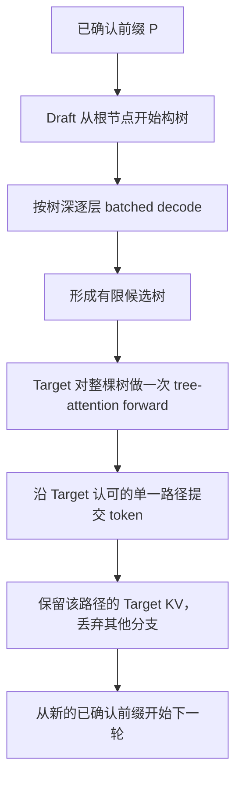

# Tree-based Speculative Decoding：Draft 构树与 Target 验证计算流程

> [返回主线：FPGA 在 LLM 领域的应用调研](./FPGA调研.md)

## 1. 核心结论

Tree-based speculative decoding 的一轮推理可以概括为：



其中最重要的计算特征是：

$$
\boxed{
\begin{aligned}
\text{Draft 构树：}&\quad \text{通常每个树深执行一次 batched decode}\\
\text{Target 验证：}&\quad \text{通常整棵树执行一次 tree-attention forward}\\
\text{一轮结束：}&\quad \text{只提交一条被认可的路径，其他分支全部丢弃}
\end{aligned}
}
$$

需要注意：

1. 同一层的分支可以组成 batch，但每个分支的隐藏状态、Attention 和新增 KV 仍需分别计算。
2. Draft 的多分支批处理主要复用模型权重读取，不能复用分叉后的前向计算。
3. Target 不需要逐分支或逐层验证，可以通过树形 Attention Mask 一次处理全部候选节点。
4. Draft KV 和 Target KV 来自不同模型，不能混用。
5. 自回归模型存在一位 logits 错位：父节点位置的 logits 用于判断其子节点 token。

---

## 2. 贯穿全文的候选树示例

假设当前已经由 Target 确认的前缀为 $P$，Draft 构造出两条候选链：

$$
P\rightarrow A\rightarrow D,
\qquad
P\rightarrow B\rightarrow C.
$$

对应的候选树为：

```text
P
├── A
│   └── D
└── B
    └── C
```

这里：

- $P$ 代表已经确认的完整历史前缀，可能包含很多 token；
- $A,B$ 位于候选树的第 1 层；
- $D,C$ 位于候选树的第 2 层；
- $A$ 与 $B$ 具有相同的逻辑位置；
- $D$ 与 $C$ 也具有相同的逻辑位置；
- 最终只可能提交 $A\rightarrow D$、$B\rightarrow C$ 或其中某条路径的一部分，不会同时提交两个分支。

---

## 3. 必须区分的四类数据

| 数据 | 含义 | 是否可以跨分支共享 | 是否可以在 Draft 与 Target 之间共享 |
|---|---|---:|---:|
| 已确认 token 前缀 $P$ | 两个模型看到的相同 token 历史 | 是 | token ID 可以共享 |
| Draft KV cache | Draft model 为 $P$ 和候选节点生成的 KV | 祖先部分可共享 | 否 |
| Target KV cache | Target model 为 $P$ 和候选节点生成的 KV | 祖先部分可共享 | 否 |
| 模型权重 | Transformer 各线性层的参数 | 同一模型的分支共用 | 两个模型通常不同 |

虽然 Draft 与 Target 处理相同的 token，但它们的 KV cache 通常具有不同的：

- 层数；
- hidden dimension；
- Attention head 数；
- KV head 数；
- 投影权重；
- 数据布局和量化格式。

因此：

$$
KV^{\text{draft}}\ne KV^{\text{target}}.
$$

Target 验证时必须自己计算所有候选节点的 Target KV，不能直接读取 Draft 构树阶段产生的 KV。

---

## 第一部分：Draft Model 构树

### 4. Draft 构树的输入状态

在一轮构树开始前，Draft model 已经具有已确认前缀 $P$ 的缓存：

$$
KV_{P}^{\text{draft}}.
$$

它还需要根节点对应的下一 token 分布：

$$
q(\cdot\mid P),
$$

其中 $q$ 表示 Draft model 的概率分布。

如果上一轮已经保存了 Draft 在前缀末尾产生的 logits，则可以直接从该分布选出第 1 层候选；否则需要先对新的前缀末尾执行一次 Draft decode。

例如，从 $q(\cdot\mid P)$ 中选择两个候选：

$$
A,B\in \mathrm{TopK}\big(q(\cdot\mid P)\big).
$$

得到：

```text
P
├── A
└── B
```

注意，draft可以使用多种采样策略，这里仅以 top-k 为例，draft发采样策略可以与target的采样策略不同。

---

### 5. Draft 按树深逐层计算

#### 5.1 第 1 层节点组成 batch

为了继续扩展 $A$ 和 $B$，将它们作为两个 batch element 同时输入 Draft model：

$$
X_1=
\begin{bmatrix}
x_A\\
x_B
\end{bmatrix}.
$$

逻辑上分别计算：

$$
h_A=\mathrm{Draft}(A;\,KV_P^{\text{draft}}),
$$

$$
h_B=\mathrm{Draft}(B;\,KV_P^{\text{draft}}).
$$

但实现上可以在一次 batched decode 中完成：

$$
\begin{bmatrix}
h_A\\
h_B
\end{bmatrix} =
\mathrm{DraftBatch}
\left(
\begin{bmatrix}
A\\
B
\end{bmatrix},
\begin{bmatrix}
KV_P^{\text{draft}}\\
KV_P^{\text{draft}}
\end{bmatrix}
\right).
$$

这次 forward 输出两个下一 token 分布：

$$
q(\cdot\mid P,A),
\qquad
q(\cdot\mid P,B).
$$

再分别从中选择下一层候选：

$$
D\sim q(\cdot\mid P,A),
\qquad
C\sim q(\cdot\mid P,B).
$$

于是得到完整示例树：

```text
P
├── A
│   └── D
└── B
    └── C
```

#### 5.2 第 2 层继续组成 batch

如果还需要构造第 3 层，则同时输入 $D,C$：

$$
X_2=
\begin{bmatrix}
x_D\\
x_C
\end{bmatrix}.
$$

但二者使用的逻辑 KV 前缀不同：

$$
KV_{D,\text{input}}^{\text{draft}} =
KV_P^{\text{draft}}
\Vert KV_A^{\text{draft}},
$$

$$
KV_{C,\text{input}}^{\text{draft}} =
KV_P^{\text{draft}}
\Vert KV_B^{\text{draft}}.
$$

同一次 batched decode 输出：

$$
q(\cdot\mid P,A,D),
\qquad
q(\cdot\mid P,B,C),
$$

用于生成第 3 层候选。

因此，Draft 构树的串行 forward 次数主要由树的深度决定，而不是由路径数量决定：

$$
T_{\text{draft-tree}}
\approx
\sum_{l=1}^{L}
T_{\text{draft-decode}}(B_l),
$$

其中：

- $L$：候选树深度；
- $B_l$：第 $l$ 层实际参与 forward 的节点数。

如果每层节点数分别为 $2,4,4$，则只需 3 次 batched decode，但仍然计算了：

$$
2+4+4=10
$$

个候选节点的前向。

---

### 6. Draft 阶段的树形 KV cache

对于示例树，可以把候选 KV 物理上扁平存放：

$$
KV_{\text{tree}}^{\text{draft}} =
KV_P^{\text{draft}}
\Vert
KV_A^{\text{draft}}
\Vert
KV_B^{\text{draft}}
\Vert
KV_D^{\text{draft}}
\Vert
KV_C^{\text{draft}}.
$$

但“物理上连续存放”不代表每个节点都能读取所有 KV。每个节点需要记录自己的祖先关系：

| 节点 | 父节点 | Draft Attention 可见的历史 |
|---|---|---|
| $A$ | root | $P$ |
| $B$ | root | $P$ |
| $D$ | $A$ | $P,A$ |
| $C$ | $B$ | $P,B$ |

当同时计算 $D,C$ 时，概念性的 KV 可见性为：

$$
M_{\text{decode}} =
\begin{array}{c|ccc}
 & P & A & B\\ \hline
Q_D & 1 & 1 & 0\\
Q_C & 1 & 0 & 1
\end{array}.
$$

于是：

$$
\mathrm{Attn}_D =
\mathrm{softmax}
\left(
\frac{Q_D[K_P;K_A]^T}{\sqrt{d_h}}
\right)
[V_P;V_A],
$$

$$
\mathrm{Attn}_C =
\mathrm{softmax}
\left(
\frac{Q_C[K_P;K_B]^T}{\sqrt{d_h}}
\right)
[V_P;V_B].
$$

实际系统可以通过以下机制表达这种关系：

- 每个节点独立的 KV block table；
- parent pointer；
- ancestor list；
- tree attention mask；
- PagedAttention 的页表映射；
- 共享前缀加 copy-on-write。

共同祖先 $KV_P$ 只需要保存一份；分叉后新增的 $KV_A,KV_B,KV_D,KV_C$ 分别计算和保存。

---

### 7. 多分支批处理到底复用了什么

对于 Transformer 中的线性层，两个分支分别需要计算：

$$
y_A=h_AW,
\qquad
y_B=h_BW.
$$

合并为 batch 后：

$$
H=
\begin{bmatrix}
h_A\\
h_B
\end{bmatrix},
\qquad
Y=HW.
$$

计算量并没有消失：

$$
\mathrm{FLOPs}(HW)
\propto
B\,d_{\text{in}}d_{\text{out}}.
$$

真正可以摊薄的是权重读取：

| 项目 | $B$ 次独立 GEMV | 一次 batched GEMM |
|---|---:|---:|
| 理想权重读取量 | $BW$ | 接近 $W$ |
| MAC 数量 | $B$ 倍 | 仍为 $B$ 倍 |
| 分支隐藏状态 | 分别计算 | 仍然分别计算 |
| 分支 Attention | 分别计算 | 可在同一 kernel 中并行 |
| 分支新增 KV | 分别生成 | 仍然分别生成 |

因此，多分支的准确收益是：

$$
\boxed{
\text{把多个不同输入对同一权重的 GEMV 合并为 GEMM，
提高权重访存复用与计算阵列利用率}
}
$$

它不意味着不同分支的前向只计算一次。

---

### 8. 控制候选树规模

如果每个节点都完整扩展 top-$k$，深度为 $L$，节点数会达到：

$$
N_{\text{full}} =
\sum_{l=1}^{L}k^l =
\frac{k^{L+1}-k}{k-1}.
$$

实际系统不会构造完整树，而会采用以下一种或多种限制：

- 固定稀疏树模板；
- 每层固定 beam width；
- 只扩展路径分数最高的 frontier 节点；
- 最大树深度；
- 全局候选节点预算；
- 概率或置信度阈值；
- 根据硬件成本进行动态剪枝。

设最终树共有 $N$ 个候选节点，则 Draft 的总节点计算量与 $N$ 相关，而串行依赖长度主要与树深 $L$ 相关。

---

## 第二部分：Target Model 整树验证

### 9. Target 验证的输入准备

Draft 完成构树后，需要把以下信息交给 Target：

1. 候选节点的 token ID；
2. 每个节点的 parent index；
3. 每个节点的逻辑 depth 或 position ID；
4. 树形 Attention Mask 或等价的祖先索引；
5. Draft 概率 $q$，如果采用随机采样下的严格接受—拒绝验证；
6. 节点的排序和物理存储布局。

示例树可以扁平化为：

| flat index | token | parent | depth | 逻辑前缀 |
|---:|---|---:|---:|---|
| 0 | $A$ | root | 1 | $P,A$ |
| 1 | $B$ | root | 1 | $P,B$ |
| 2 | $D$ | 0 | 2 | $P,A,D$ |
| 3 | $C$ | 1 | 2 | $P,B,C$ |

Target 在验证开始前只有已确认前缀的 Target KV：

$$
KV_P^{\text{target}}.
$$

候选节点的 Target KV 尚不存在，必须在本次验证 forward 中重新计算。

---

### 10. 整棵树的一次 tree-attention forward

将所有候选 token 一次性输入 Target：

$$
X_{\text{tree}} =
[A,B,D,C].
$$

在每一层 Transformer 中，Target 会同时为所有候选节点计算：

$$
Q_{\text{tree}}=X_{\text{tree}}W_Q,
$$

$$
K_{\text{tree}}=X_{\text{tree}}W_K,
\qquad
V_{\text{tree}}=X_{\text{tree}}W_V.
$$

然后使用树形因果 Mask，保证每个节点只看到：

1. 已确认前缀 $P$；
2. 自己的祖先候选节点；
3. 当前节点自身。

示例的候选节点间 Mask 为：

$$
M_{\text{tree}} =
\begin{array}{c|cccc}
 & A & B & D & C\\ \hline
A & 1 & 0 & 0 & 0\\
B & 0 & 1 & 0 & 0\\
D & 1 & 0 & 1 & 0\\
C & 0 & 1 & 0 & 1
\end{array}.
$$

所有行另外都允许读取 $KV_P^{\text{target}}$。

因此：

- $A$ 看到 $P,A$；
- $B$ 看到 $P,B$；
- $D$ 看到 $P,A,D$；
- $C$ 看到 $P,B,C$；
- $D$ 不能看到 $B,C$；
- $C$ 不能看到 $A,D$。

这次 forward 在逻辑上等价于分别处理两条序列：

$$
[P,A,D],
\qquad
[P,B,C],
$$

但不会重复计算公共前缀，也不需要分别启动两次 Target forward。

---

### 11. Position ID 不能使用扁平数组下标

虽然候选节点在内存中排列为：

$$
[A,B,D,C],
$$

但它们的逻辑位置应由树深决定。

设前缀 $P$ 的长度为 $S$，则：

$$
\mathrm{pos}(A) =
\mathrm{pos}(B)
=S,
$$

$$
\mathrm{pos}(D) =
\mathrm{pos}(C)
=S+1.
$$

不能错误地设置为：

$$
S,S+1,S+2,S+3,
$$

否则 RoPE 或其他位置编码会把四个节点误认为同一条线性序列，导致不同分支的位置语义错误。

---

### 12. 自回归 logits 的一位错位

这是整个验证过程最容易混淆的部分。

自回归模型在输入一个 token 后，输出的是“下一个 token”的分布：

$$
\mathrm{Target}(P,A)
\longrightarrow
p(\cdot\mid P,A).
$$

因此：

- 判断 $A$ 是否被 Target 接受，需要使用根状态产生的 $p(A\mid P)$；
- 判断 $D$ 是否被接受，需要使用节点 $A$ 位置产生的 $p(D\mid P,A)$；
- 输入节点 $D$ 后产生的是 $p(\cdot\mid P,A,D)$，它用于生成或判断 $D$ 后面的 token，而不是判断 $D$ 自身。

Target 整树 forward 最终提供：

$$
p(\cdot\mid P,A),
\quad
p(\cdot\mid P,B),
\quad
p(\cdot\mid P,A,D),
\quad
p(\cdot\mid P,B,C).
$$

而第 1 层节点 $A,B$ 的判断还需要：

$$
p(\cdot\mid P).
$$

该根分布通常来自：

- 已确认前缀最后一个位置保存的 Target logits；或
- 当前验证实现中额外包含的根状态计算。

父子 token 与验证 logits 的对应关系为：

| 被验证的候选 token | 使用哪个状态的 Target logits |
|---|---|
| $A$ 或 $B$ | root：$p(\cdot\mid P)$ |
| $D$ | 节点 $A$：$p(\cdot\mid P,A)$ |
| $C$ | 节点 $B$：$p(\cdot\mid P,B)$ |
| $D$ 后继 token | 节点 $D$：$p(\cdot\mid P,A,D)$ |
| $C$ 后继 token | 节点 $C$：$p(\cdot\mid P,B,C)$ |

---

### 13. Greedy decoding 下的路径验证

如果 Target 使用 greedy decoding，验证可以看成从根节点开始沿树向下匹配。

#### 第 1 步：从根节点选择 Target token

$$
t_1^* =
\arg\max_t p(t\mid P).
$$

然后检查 $t_1^*$ 是否存在于根节点的候选孩子集合：

$$
\mathrm{Children}(\text{root})=\{A,B\}.
$$

- 如果 $t_1^*=A$，接受 $A$，进入节点 $A$；
- 如果 $t_1^*=B$，接受 $B$，进入节点 $B$；
- 如果 $t_1^*\notin\{A,B\}$，树在第 1 层失配，输出 Target 自己的 $t_1^*$，结束本轮。

#### 第 2 步：沿选中的分支继续验证

假设第 1 步选择 $A$，则：

$$
t_2^* =
\arg\max_t p(t\mid P,A).
$$

检查：

$$
t_2^*\stackrel{?}{=}D.
$$

- 如果相等，接受 $D$，继续沿 $A\rightarrow D$ 验证；
- 如果不相等，停止接受 Draft 路径，并输出 Target 的 $t_2^*$。

如果第 1 步选择的是 $B$，则用：

$$
\arg\max_t p(t\mid P,B)
$$

检查候选 $C$。

#### Greedy 验证伪代码

```python
parent = root
accepted = []

while True:
    target_token = argmax(target_logits[parent])
    child = find_child_with_token(parent, target_token)

    if child does not exist:
        commit(target_token)
        break

    accepted.append(child.token)
    commit(child.token)
    parent = child

    if parent has no candidate children:
        bonus_token = argmax(target_logits[parent])
        commit(bonus_token)
        break
```

这里的 `target_logits[parent]` 表示“给定该父节点所代表的完整前缀后，下一个 token 的 Target 分布”。

---

### 14. Sampling decoding 下的验证

当 Target 使用随机采样时，不能简单比较 argmax。对于普通链式 speculative decoding，候选 token $x$ 的经典接受概率为：

$$
\alpha(x) =
\min\left(
1,
\frac{p(x\mid \text{history})}
{q(x\mid \text{history})}
\right).
$$

其中：

- $p$：Target 分布；
- $q$：Draft 分布。

若候选被拒绝，则从校正后的 residual distribution 中采样：

$$
p_{\text{res}}(x)
\propto
\max\bigl(0,p(x)-q(x)\bigr).
$$

普通链式 speculative decoding 的 draft 输出一般为单条 token 链，而 Tree-based sampling verification 的 draft 输出则为树结构，所以具体 decodeing 实现会随算法不同而变化，因为同一个父节点可能有多个候选孩子。常见做法包括：

- 按规定顺序对兄弟候选执行接受—拒绝；
- 使用无放回采样构造候选集合；
- 对树节点记录条件 Draft 概率并执行树形校正；
- 使用专门证明无偏性的多候选验证算法。

但无论采用哪种方法，验证仍然遵守两个约束：

1. 只能沿一条父子相连的路径提交 token；
2. 一旦某个位置拒绝候选并由 Target 产生校正 token，本轮候选树的后续节点全部失效。

因此，不能把 greedy 下的简单路径匹配直接用于要求严格保持 Target 采样分布的场景。

---

### 15. Target KV 的保留与回收

Target 的 tree-attention forward 已经为所有候选节点计算了 KV：

$$
KV_A^{\text{target}},
KV_B^{\text{target}},
KV_D^{\text{target}},
KV_C^{\text{target}}.
$$

假设最终接受路径为：

$$
P\rightarrow A\rightarrow D.
$$

则一轮结束后：

- 保留 $KV_A^{\text{target}}$；
- 保留 $KV_D^{\text{target}}$；
- 释放或复用 $KV_B^{\text{target}}$；
- 释放或复用 $KV_C^{\text{target}}$；
- 下一轮从 $P,A,D$ 开始。

如果 Target 在失配位置产生了一个不在候选树中的 token $X$，则本次 tree forward 通常只得到了用于预测 $X$ 的 logits，并没有计算 $X$ 自身的 KV。此时：

- $X$ 可以立即作为已提交 token；
- 下一轮第一次 forward 会把 $X$ 输入模型并生成 $KV_X$；
- 或者系统额外执行一次 decode，提前得到 $KV_X$。

这取决于 runtime 如何组织下一轮，但不影响输出分布的正确性。

---

## 第三部分：完整时间线

### 16. 示例的一轮端到端计算

#### 阶段 A：已有状态

已确认前缀：

$$
P.
$$

缓存：

$$
KV_P^{\text{draft}},
\qquad
KV_P^{\text{target}}.
$$

Draft 与 Target 的 KV 是两套独立缓存。

#### 阶段 B：Draft 产生第 1 层候选

从：

$$
q(\cdot\mid P)
$$

选出：

$$
A,B.
$$

#### 阶段 C：Draft 一次 batched decode 扩展第 1 层

同时输入：

$$
[A,B].
$$

二者都读取：

$$
KV_P^{\text{draft}}.
$$

得到：

$$
q(\cdot\mid P,A),
\qquad
q(\cdot\mid P,B).
$$

选择：

$$
D,C.
$$

#### 阶段 D：形成候选树并打包元数据

候选节点：

$$
[A,B,D,C].
$$

父节点：

$$
[\text{root},\text{root},A,B].
$$

position ID：

$$
[S,S,S+1,S+1].
$$

#### 阶段 E：Target 整树一次 forward

Target 读取：

$$
KV_P^{\text{target}},
$$

并为 $[A,B,D,C]$ 计算新的 Target Q/K/V。

tree mask 保证：

$$
D\rightarrow \{P,A,D\},
\qquad
C\rightarrow \{P,B,C\}.
$$

#### 阶段 F：使用父节点 logits 沿树验证

1. 用 $p(\cdot\mid P)$ 在 $A,B$ 中寻找匹配；
2. 如果选择 $A$，用 $p(\cdot\mid P,A)$ 验证 $D$；
3. 如果选择 $B$，用 $p(\cdot\mid P,B)$ 验证 $C$；
4. 在首次失配处停止，或一直走到叶节点；
5. 必要时提交一个 Target 产生的 bonus/correction token。

#### 阶段 G：提交和 KV 回收

只保留最终接受路径的 Target KV，释放其他分支；Draft 侧候选 KV 也相应剪枝或在下一轮重建。

---

### 17. Draft 与 Target 计算方式对照

| 对比项 | Draft 构树 | Target 验证 |
|---|---|---|
| 模型 | 小模型或轻量 draft head | 完整大模型 |
| 输入组织 | 按树深分批输入 frontier 节点 | 一次输入整棵候选树 |
| forward 次数 | 通常约等于树深 | 通常为 1 次 |
| Attention | 每个 frontier 节点读取自身祖先 KV | 所有节点通过 tree mask 同时计算 |
| 已确认前缀 KV | 使用 Draft KV | 使用 Target KV |
| 候选节点 KV | 构树时逐层产生 | 验证 forward 中一次产生 |
| 分支隔离 | 独立 block table、祖先索引或 mask | tree causal mask |
| 主要收益 | 多分支权重读取复用，提高 Draft 利用率 | 将多条路径验证合并为短 prefill |
| 主要代价 | 额外分支计算和 Draft KV | 验证所有未必会被接受的候选节点 |

---

### 18. 为什么 Target 能整树一次验证，而 Draft 通常需要逐层构树

Target 验证时，整棵候选树的 token 已经由 Draft 给出，因此 Target 可以一次拿到：

$$
[A,B,D,C,\ldots].
$$

借助 tree causal mask，Transformer 的每一层可以并行计算所有候选节点。

Draft 构树时则不同：下一层 token 尚未产生。例如：

$$
D
$$

必须根据：

$$
q(\cdot\mid P,A)
$$

才能确定，而该分布只有在 $A$ 完成 Draft forward 后才存在。因此树深之间存在真正的数据依赖：

$$
\text{第 }l\text{ 层 hidden states}
\rightarrow
\text{第 }l+1\text{ 层 token}
\rightarrow
\text{第 }l+1\text{ 层 hidden states}.
$$

所以：

$$
\boxed{
\text{同一树层可以并行，树的不同深度通常必须串行生成}
}
$$

Medusa 类多头方法或某些非自回归 draft 结构可以在一次 forward 中直接提出多个深度的候选，但这属于特殊的 Draft 架构，不能等同于普通自回归 Draft model。

---

### 19. 性能成本模型

Tree-based speculative decoding 并不会减少候选节点的数学计算量。它通过批处理与一次性验证降低壁钟时间，并希望提高每轮接受的 token 数。

可以用以下指标判断是否值得：

$$
T_{\text{per committed token}} =
\frac{
T_{\text{draft-tree}}
+
T_{\text{target-verify}}
+
T_{\text{communication}}
+
T_{\text{tree-management}}
}{
\mathbb{E}[L_{\text{commit}}]
}.
$$

其中：

- $T_{\text{draft-tree}}$：逐层构树的时间；
- $T_{\text{target-verify}}$：Target 整树 forward 的时间；
- $T_{\text{communication}}$：Draft 与 Target 之间传输 token 和树元数据的时间；
- $T_{\text{tree-management}}$：节点选择、mask 构造和 KV 页表管理；
- $\mathbb{E}[L_{\text{commit}}]$：每轮平均提交 token 数。

树越宽：

- 候选命中率可能提高；
- Draft 权重利用率可能提高；
- Draft MAC 数、Attention、KV 写入都会增加；
- Target 验证节点数也会增加；
- 最终未被接受的节点计算全部浪费。

因此性能目标不是最大化树宽或接受长度，而是最小化：

$$
\boxed{
\text{每个最终提交 token 的端到端时间}
}
$$

---

### 20. 常见误区

#### 误区 1：不同分支的 KV 不同，所以不能组成 batch

错误。不同分支可以作为不同 batch element，在同一 kernel 中并行计算；只需要给每个 query 提供独立的 KV 地址或可见性 Mask。

#### 误区 2：组成 batch 后，不同分支的前向只需计算一次

错误。复用的是权重读取和共同祖先 KV 的存储，分叉后的隐藏状态、MAC、Attention、softmax 和新增 KV 都要分别计算。

#### 误区 3：Target 需要逐条候选链分别运行

通常错误。Target 可以把所有候选节点打包为一次短 prefill，通过 tree causal mask 一次验证整棵树。

#### 误区 4：输入 $D$ 后得到的 logits 用来验证 $D$

错误。输入 $D$ 后得到的是：

$$
p(\cdot\mid P,A,D),
$$

用于预测 $D$ 的后继 token。验证 $D$ 应使用节点 $A$ 位置的：

$$
p(D\mid P,A).
$$

#### 误区 5：Draft KV 可以直接交给 Target

错误。Draft 和 Target 是不同模型，Target 必须重新计算候选节点的 Target KV。

#### 误区 6：扁平数组中的相邻节点具有连续 position ID

错误。position ID 由树深决定，而不是由候选节点的物理排列下标决定。

#### 误区 7：树会跨多轮一直增长

错误。每轮验证后只提交一条路径，其他分支立即丢弃；下一轮从新的已确认前缀重新构造有限候选树。

---

### 21. 最终总结

Tree-based speculative decoding 的本质是：

$$
\boxed{
\text{用更多但可并行的 Draft 候选计算，
换取更高的路径命中率和更长的单轮提交长度}
}
$$

从计算流程看：

1. Draft 从已确认前缀 $P$ 出发；
2. 同一深度的候选节点组成 batch；
3. 每个节点只读取自己路径上的 Draft KV；
4. 树深之间因为 token 生成依赖而串行；
5. 构树结束后，把整棵树及其 parent、position、概率等元数据交给 Target；
6. Target 使用自己的前缀 KV，对全部候选节点执行一次 tree-attention forward；
7. 使用父节点位置的 logits 判断子节点；
8. 沿 Target 接受的唯一一条路径向下提交；
9. 保留该路径的 Target KV，释放其他分支；
10. 从新的已确认前缀开始下一轮。

最简洁的表示为：

$$
\boxed{
\text{Draft：按层构树}
\quad\longrightarrow\quad
\text{Target：整树验证}
\quad\longrightarrow\quad
\text{只提交一条路径}
}
$$
